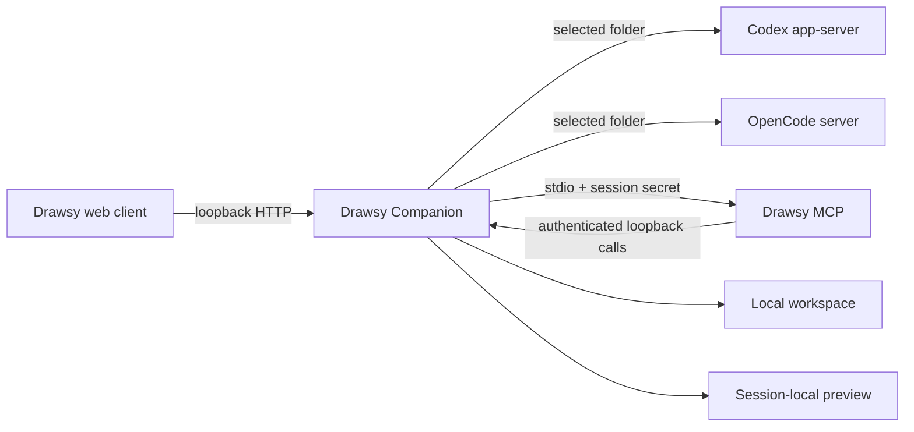

# Drawsy Companion

[](https://github.com/DrawsyAI/drawsy-ai-companion/actions/workflows/ci.yml)
[](https://github.com/DrawsyAI/drawsy-ai-companion/releases/latest)
[](LICENSE)

Drawsy Companion is the local desktop runtime that connects the Drawsy web client to Codex or OpenCode already installed on the user's device.

It is a bridge, not an AI engine, hosted backend, or cloud service. The desktop app keeps the local bridge available in the background, detects the installed engines, starts a scoped local session when Drawsy requests one, and exposes the Drawsy MCP only to that session.

## Downloads

Installers are published on the [GitHub Releases page](https://github.com/DrawsyAI/drawsy-ai-companion/releases/latest).

| Platform | Release artifacts |
| --- | --- |
| macOS | `.dmg`, `.zip` |
| Windows | `.exe` installer, `.zip` |
| Linux | `.AppImage`, `.deb` |

Install and launch the companion when you want to use local mode. It stays visible as a tray/menu-bar application while it is running and listens only on loopback. It does not start automatically when you sign in. Quit the companion from its tray/menu-bar menu to stop local access; a terminal process is not required for normal use.

The companion does not install, bundle, or authenticate Codex or OpenCode. The user must already have one of those engines available on the device. The tray status reports which engine is detected. Codex is supported on the packaged desktop targets; the current OpenCode runtime supports macOS and Linux.

## Runtime contract



The local path provides:

- installed Codex/OpenCode detection through `GET /v1/engines`;
- an OS-selected folder as the single workspace boundary for an agent session;
- surface-scoped canvas, presentation, image, context, and preview operations;
- local conversation state and session cleanup;
- a loopback-only bridge at `http://127.0.0.1:3031` by default; and
- a per-session stdio MCP process authenticated back to the bridge.

The MCP is not a public HTTP service. It is launched for a local agent session, receives the session-scoped environment, and can call only authenticated loopback routes. The bridge does not expose backend code, credentials, or a public MCP endpoint.

The default companion path is local-only: selected folders, agent sessions, previews, and local conversation state remain on the device. Cloud connector/resource calls are disabled unless `DRAWSY_CONNECTOR_BACKEND_URL` is explicitly configured for an integrated deployment.

## Scope

### Included

- Electron tray/background application;
- local Codex app-server lifecycle;
- local OpenCode server lifecycle;
- installed-engine detection;
- selected-folder permission and sandbox boundary;
- Drawsy bridge protocol and loopback authentication;
- surface-scoped Drawsy MCP;
- local canvas context, image transfer, conversation state, and live-preview handoff;
- cross-platform static checks and protocol tests; and
- GitHub Actions packaging for macOS, Windows, and Linux.

### Not included

- Codex or OpenCode binaries, installers, or account authentication;
- Drawsy web client;
- hosted workspace copying or remote preview proxying;
- cloud backend and connector authorization services;
- deployment manifests and production credentials; or
- the historical standalone Excalidraw MCP demo/server.

The detailed boundary is documented in [`FEATURE-BOUNDARY.md`](FEATURE-BOUNDARY.md).

## Repository layout

- `src/app/main.ts` — Electron lifecycle, visible tray/menu-bar status, manual startup, and bridge ownership.
- `src/drawsy/bridge.ts` — loopback HTTP bridge, sessions, folder scope, context, previews, and local state.
- `src/drawsy/mcp.ts` — stdio Drawsy MCP entry point and tool surface.
- `src/drawsy/codex-app-server.ts` — Codex process and app-server protocol integration.
- `src/drawsy/opencode-app-server.ts` — OpenCode server integration and ephemeral runtime setup.
- `src/drawsy/*-binary.ts` — installed-engine resolution and version detection.
- `src/drawsy/*.test.ts` — protocol, security-boundary, context, and lifecycle tests.
- `.github/workflows/ci.yml` — static checks and tests on all three desktop operating systems.
- `.github/workflows/release.yml` — tagged cross-platform packaging and GitHub Release publication.

## Development

Requirements: Node.js `>=20.12` and pnpm `10.11.0` through Corepack.

```bash
corepack pnpm install --frozen-lockfile
corepack pnpm run check
```

The local Electron app can be started with:

```bash
corepack pnpm run dev
```

The bridge and MCP entries are also available for protocol-level development:

```bash
corepack pnpm run start:bridge
corepack pnpm run start:mcp
```

`pnpm run check` compiles the bridge and runs the repository's static/unit protocol suite. It does not start the Drawsy web client, manage existing local servers, or perform browser automation.

## Packaging and releases

Build locally without publishing:

```bash
corepack pnpm run package
```

`package:dir` creates an unpacked platform application for local inspection. `package` creates the installer artifacts in `release/` and never publishes them.

Pushing a version tag matching `v*` starts the release workflow. The workflow:

1. installs from the frozen lockfile on Ubuntu, macOS, and Windows;
2. runs the complete static/test check on each runner;
3. builds the native installer artifacts;
4. generates `SHA256SUMS`; and
5. publishes the artifacts to the corresponding GitHub Release.

The release page is the end-user distribution surface: [Drawsy Companion Releases](https://github.com/DrawsyAI/drawsy-ai-companion/releases/latest).

The current workflow produces unsigned installers. Platform signing and notarization require organization-held Apple, Windows, and Linux signing credentials; no credentials are stored in this repository.

## Contributing

See [`CONTRIBUTING.md`](CONTRIBUTING.md) for the repository-specific change boundary, validation baseline, and pull-request requirements.

Contributions must keep the local bridge loopback-only, preserve selected-folder/session scoping, avoid adding hosted backend code or secrets, and include focused tests for observable protocol behavior. Security issues must follow [`SECURITY.md`](SECURITY.md), not a public issue.

## License

MIT. See [`LICENSE`](LICENSE).
