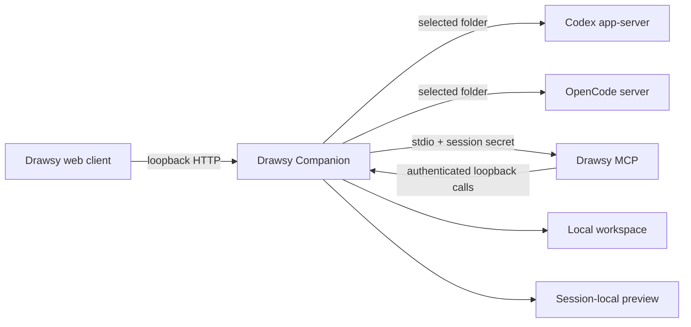

# Drawsy Companion

[](https://github.com/DrawsyAI/drawsy-ai-companion/actions/workflows/ci.yml)
[](https://github.com/DrawsyAI/drawsy-ai-companion/releases/latest)
[](LICENSE)

Drawsy Companion is the local desktop runtime that connects the Drawsy web client to Codex or OpenCode already installed on the user's device.

It is a bridge, not an AI engine, hosted backend, or cloud service. The desktop app keeps the local bridge available in the background, detects the installed engines, starts a scoped local session when Drawsy requests one, and exposes the Drawsy MCP only to that session.

## Downloads

Installers are published on the [GitHub Releases page](https://github.com/DrawsyAI/drawsy-ai-companion/releases/latest).

| Platform | Release artifacts |
| --- | --- |
| macOS | `.dmg`, `.zip` |
| Windows | unsigned `.zip` test build; `.appx` for Microsoft Store submission |
| Linux | `.AppImage`, `.deb` |

For direct Windows testing, extract the ZIP and run `drawsy-companion.exe`. The ZIP is unsigned and Windows may show a security warning. The AppX is a Store submission package; Microsoft signs it after certification. It is not a signed installer for direct download.

Install and launch the companion when you want to use local mode. It stays visible as a tray/menu-bar application while it is running and listens only on loopback. Windows opens a small welcome window with **Open Drawsy**, which opens https://drawsyai.com in your default browser, and the Companion, Codex, and OpenCode statuses. Status is refreshed when you reopen the window or choose **Refresh engine status** in the tray menu. Linux keeps its existing status window. Click the tray icon or choose **Open status window** to reopen it. Closing the window hides it back to the tray. It does not start automatically when you sign in. Choose **Quit Drawsy Companion** from the tray/menu-bar menu to stop local access; a terminal process is not required for normal use.

The companion does not install, bundle, or authenticate Codex or OpenCode. The user must already have one of those engines available on the device. The tray status reports which engine is detected. Codex is supported on the packaged desktop targets; the current OpenCode runtime supports macOS and Linux.

## Native current-tab drawing

Draw mode uses the user's installed external Google Chrome extension when it is available. It does not target Codex's in-app Browser, copy or publish OpenAI's proprietary browser plugin, expose browser credentials, or add a custom drawing tool. The Drawsy-specific policy tells Codex to use the real Drawsy UI and native pointer input for requested gestures—including selecting a Drawsy shape tool and dragging—while keeping Drawsy MCP for explicit structured/data-level work.

The Chrome plugin and its browser extension must already be installed and connected on the device. Each Drawsy page publishes an opaque per-tab marker; before acting, the agent claims a fresh Chrome tab snapshot and verifies that marker, so identical Drawsy tabs cannot be confused. If the marker cannot be verified, Companion fails closed instead of drawing in a guessed tab or substituting MCP objects for a requested gesture. Broad desktop Computer Use remains disabled.

The release bundles Drawsy's `drawsy-browser-use` and `drawsy-teaching-diagrams` skills, including the browser-use tool catalog. Browser-use guidance is attached for Draw mode and explicit current-tab/browser requests; the teaching skill is attached only in Draw mode. They are an explicit allowlist, so adding future skills does not make the model randomly load every bundled skill.

## Runtime contract


```mermaid
flowchart LR
  Web["Drawsy web client"] -->|"loopback HTTP"| Companion["Drawsy Companion"]
  Companion -->|"selected folder"| Codex["Codex app-server"]
  Companion -->|"selected folder"| OpenCode["OpenCode server"]
  Companion -->|"stdio + session secret"| MCP["Drawsy MCP"]
  MCP -->|"authenticated loopback calls"| Companion
  Companion --> Folder["Local workspace"]
  Companion --> Preview["Session-local preview"]
```

The local path provides:

- installed Codex/OpenCode detection through `GET /v1/engines`;
- an OS-selected folder as the single workspace boundary for an agent session;
- surface-scoped canvas, presentation, image, context, and preview operations;
- local conversation state and session cleanup;
- a loopback-only bridge at `http://127.0.0.1:3031` by default; and
- a per-session stdio MCP process authenticated back to the bridge.

The MCP is not a public HTTP service. It is launched for a local agent session, receives the session-scoped environment, and can call only authenticated loopback routes. The bridge does not expose backend code, credentials, or a public MCP endpoint.

The default companion path is local-only: selected folders, agent sessions, previews, and local conversation state remain on the device. Connector/resource grants are short-lived values issued by the Drawsy backend for one turn; the companion does not persist them or ship provider credentials. Release builds route trusted local Drawsy origins to `http://127.0.0.1:3004` and trusted hosted Drawsy origins to the configured public backend. Set `DRAWSY_CONNECTOR_BACKEND_URL` to override that routing for another deployment. Unknown browser origins remain unable to use connector/resource execution.

### Fast diagrams

Turns may specify `generationMode: "fast"` or `"draw"`; older clients default to Draw. `GET /v1/engines` advertises supported modes for client compatibility. Fast Mode uses diagram code to create whole diagrams while normal canvas management remains available: raw edits can update or delete existing elements, connectors and labels can target existing elements, and image, capture, and preview workflows remain supported. The bridge marks raw edits for live existing-ID validation. Fast Mode remains active after a turn ends until the user starts a Draw turn. The bundled Fast skill is loaded without the Draw teaching-diagram skill.

Mermaid input is limited to 256 KiB UTF-8 and requires an `operationId`; `replaceOperationId` replaces only a prior converter-created group. The canvas capability response describes the installed converter's editable families and image fallback. The bridge enforces mode restrictions on internal canvas requests, so suppressing tools in the interface is not the security boundary.

## Scope

### Included

- Electron tray/background application;
- local Codex app-server lifecycle;
- local OpenCode server lifecycle;
- installed-engine detection;
- selected-folder permission and sandbox boundary;
- Drawsy bridge protocol and loopback authentication;
- surface-scoped Drawsy MCP;
- local canvas context, image transfer, conversation state, and live-preview handoff;
- cross-platform static checks and protocol tests; and
- GitHub Actions packaging for macOS, Windows, and Linux.

### Not included

- Codex or OpenCode binaries, installers, or account authentication;
- Drawsy web client;
- hosted workspace copying or remote preview proxying;
- cloud backend and connector authorization services;
- deployment manifests and production credentials; or
- the historical standalone Excalidraw MCP demo/server.

The detailed boundary is documented in [`FEATURE-BOUNDARY.md`](FEATURE-BOUNDARY.md).

## Repository layout

- `src/app/main.ts` — Electron lifecycle, visible tray/menu-bar status, manual startup, and bridge ownership.
- `src/drawsy/bridge.ts` — loopback HTTP bridge, sessions, folder scope, context, previews, and local state.
- `src/drawsy/mcp.ts` — stdio Drawsy MCP entry point and tool surface.
- `src/drawsy/codex-app-server.ts` — Codex process and app-server protocol integration.
- `src/drawsy/opencode-app-server.ts` — OpenCode server integration and ephemeral runtime setup.
- `src/drawsy/*-binary.ts` — installed-engine resolution and version detection.
- `src/drawsy/*.test.ts` — protocol, security-boundary, context, and lifecycle tests.
- `.github/workflows/ci.yml` — static checks and tests on all three desktop operating systems.
- `.github/workflows/release.yml` — tagged cross-platform packaging and GitHub Release publication.

## Development

Requirements: Node.js `>=20.12` and pnpm `10.11.0` through Corepack.

```bash
corepack pnpm install --frozen-lockfile
corepack pnpm run check
```

The local Electron app can be started with:

```bash
corepack pnpm run dev
```

The bridge and MCP entries are also available for protocol-level development:

```bash
corepack pnpm run start:bridge
corepack pnpm run start:mcp
```

`pnpm run check` compiles the bridge and runs the repository's static/unit protocol suite. It does not start the Drawsy web client, manage existing local servers, or perform browser automation.

## Packaging and releases

Build locally without publishing:

```bash
corepack pnpm run package
```

`package:dir` creates an unpacked platform application for local inspection. `package` creates the installer artifacts in `release/` and never publishes them.

Pushing a version tag matching `v*` starts the release workflow. The workflow:

1. installs from the frozen lockfile on Ubuntu, macOS, and Windows;
2. runs the complete static/test check on each runner;
3. builds the native installer artifacts;
4. generates `SHA256SUMS`; and
5. publishes the artifacts to the corresponding GitHub Release.

The release page is the end-user distribution surface: [Drawsy Companion Releases](https://github.com/DrawsyAI/drawsy-ai-companion/releases/latest).

The macOS release job signs the app with an Apple Developer ID Application certificate and submits the preserved signed app to Apple with an App Store Connect Team API key. It waits up to 20 minutes for the normal notarization path, then staples and validates Apple's ticket before creating the public DMG and ZIP. The credentials are supplied only through GitHub Actions secrets; no certificate, private key, or account credential is stored in this repository.

Configure these repository secrets before pushing a release tag:

- `MAC_CSC_LINK` — one-line base64 of the password-protected Developer ID `.p12` bundle.
- `MAC_CSC_KEY_PASSWORD` — the password protecting that `.p12` bundle.
- `APPLE_API_KEY_BASE64` — one-line base64 of the App Store Connect Team API `.p8` key.
- `APPLE_API_KEY_ID` — the 10-character Team API key ID.
- `APPLE_API_ISSUER` — the App Store Connect issuer UUID.
- `MAC_RECOVERY_ENCRYPTION_KEY` — a random high-entropy secret used only to encrypt resumable Mac release artifacts.

The workflow reconstructs the `.p8` only in the macOS runner’s temporary directory, passes its path to `notarytool`, and fails before packaging if any Mac signing secret is missing. Before waiting on Apple, it preserves the signed app and notarization metadata in an encrypted GitHub Actions recovery artifact; the plaintext app and credentials are not exposed through the public repository. If Apple holds a submission longer than the bounded wait, do not rerun the release and create a duplicate submission. After Apple reports `Accepted`, run **Finalize Delayed macOS Release** with the source release workflow run ID; it restores the exact signed app, staples and validates the ticket, packages the DMG and ZIP, and publishes the complete release. Existing Windows and Linux releases remain unsigned; the Windows Store package is built as AppX, while Linux artifacts remain unsigned.

Windows release builds create a Microsoft Store AppX package. Configure these repository variables with the identity values shown by Partner Center after the product type is set to MSIX/AppX:

- `STORE_APPX_IDENTITY_NAME` — the Store package identity name.
- `STORE_APPX_PUBLISHER` — the exact Store publisher value.
- `STORE_APPX_PUBLISHER_DISPLAY_NAME` — the publisher display name shown by Partner Center.

These values are public package metadata, not signing credentials. Run **Build DrawsyAI Companion Store Package** from GitHub Actions to build only the Windows x64 package. It checks the package signature state and manifest name, identity, publisher, and version, then retains the `.appx` file as an Actions artifact for Partner Center upload. Microsoft signs the package after Store certification. No Windows certificate or signing secret is required for Store distribution.

## Contributing

See [`CONTRIBUTING.md`](CONTRIBUTING.md) for the repository-specific change boundary, validation baseline, and pull-request requirements.

Contributions must keep the local bridge loopback-only, preserve selected-folder/session scoping, avoid adding hosted backend code or secrets, and include focused tests for observable protocol behavior. Security issues must follow [`SECURITY.md`](SECURITY.md), not a public issue.

## License

MIT. See [`LICENSE`](LICENSE).

## Environment operation

See [ENVIRONMENT.md](ENVIRONMENT.md) for explicit modes, local configuration, production boundaries, and verification rules.
